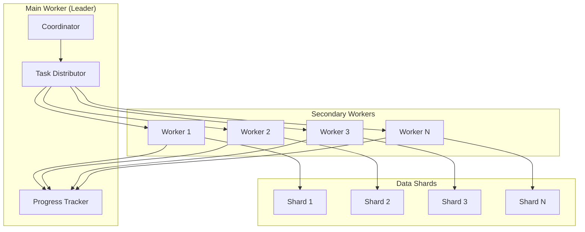
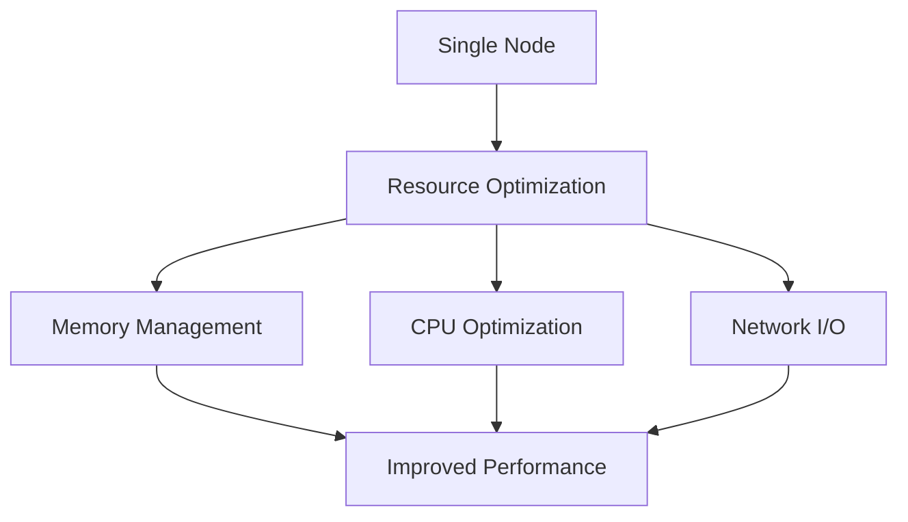
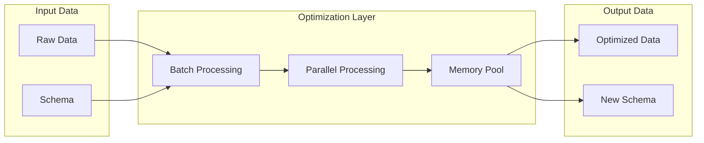
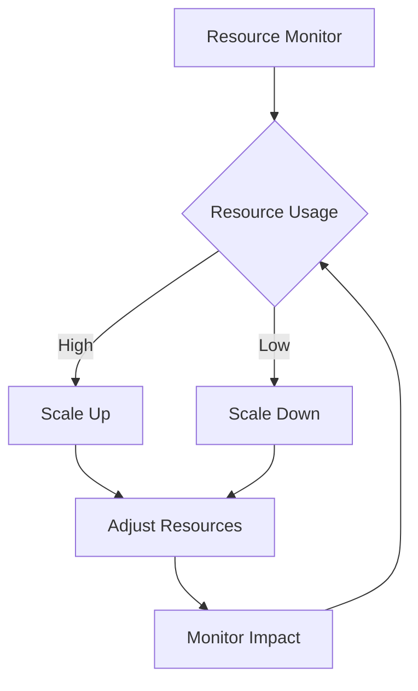
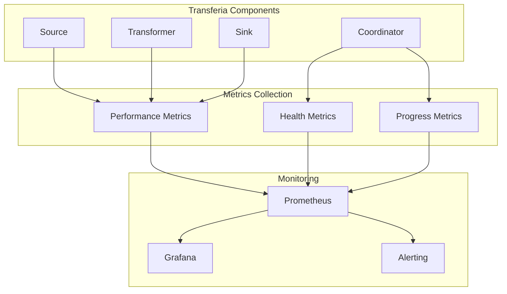
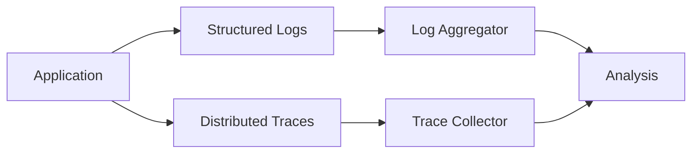
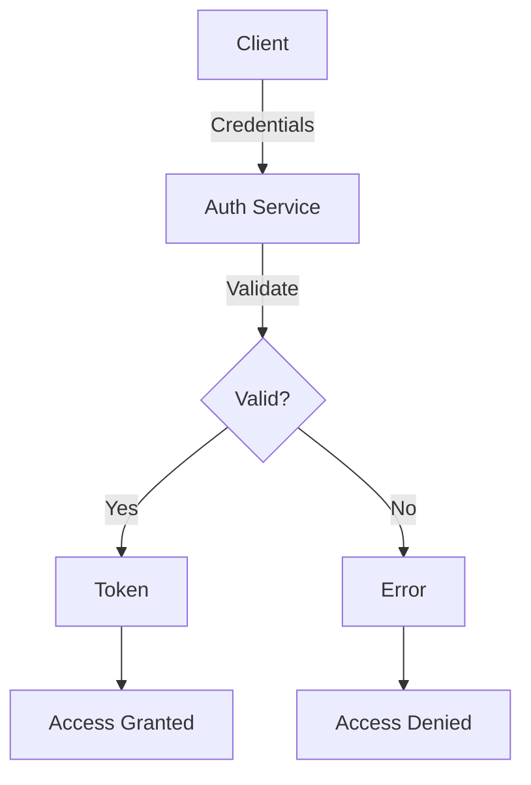
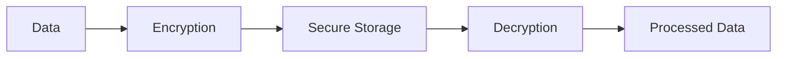

# Advanced Topics

This document covers advanced topics in Transferia.

## Scaling

### Horizontal Scaling



Key features:
- Worker coordination
- Data sharding
- Load balancing
- Progress tracking

### Vertical Scaling



Key features:
- Resource optimization
- Memory management
- CPU utilization
- Network efficiency

## Performance Optimization

### Data Processing Pipeline



Key optimizations:
- Batch processing
- Parallel execution
- Memory pooling
- Schema optimization

### Resource Management



Key features:
- Resource monitoring
- Dynamic scaling
- Performance tracking
- Cost optimization

## Monitoring

### Metrics Collection



Key metrics:
- Performance metrics
- Health checks
- Progress tracking
- Resource usage

### Logging and Tracing



Key features:
- Structured logging
- Distributed tracing
- Log aggregation
- Trace analysis

## Advanced Features

### Custom Transformers

```go
// Custom transformer implementation
type CustomTransformer struct {
    config Config
}

func (t *CustomTransformer) Transform(items []ChangeItem) []ChangeItem {
    // Custom transformation logic
    return transformedItems
}
```

Key aspects:
- Custom logic
- Performance optimization
- Error handling
- State management

### Plugin Development

```go
// Custom source plugin
type CustomSource struct {
    config Config
    logger log.Logger
}

func (s *CustomSource) Run(sink AsyncSink) error {
    // Custom source implementation
    return nil
}
```

Key features:
- Plugin interface
- Configuration
- Error handling
- Resource management

## Security

### Authentication



Key features:
- Token-based auth
- Role management
- Access control
- Security policies

### Data Protection



Key features:
- Data encryption
- Secure storage
- Access control
- Audit logging

## Next Steps

- Check out [Examples](../examples)
- Join the [Community](https://github.com/transferia/transferia/discussions)
- Contribute to the project 