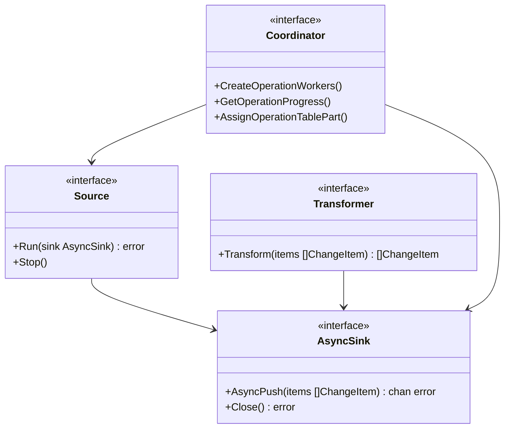

# Architecture Overview

This document provides a comprehensive overview of the Transferia architecture.

## System Components


## Data Flow


## Core Components

### Source Plugin

The Source Plugin is responsible for reading data from various data sources. It implements the following interface:

```go
type Source interface {
    Run(sink AsyncSink) error
    Stop()
}
```

Key features:
- Asynchronous data reading
- Support for different data sources
- Error handling and recovery
- Progress tracking

### Sink Plugin

The Sink Plugin writes data to various destinations:

```go
type AsyncSink interface {
    AsyncPush(items []ChangeItem) chan error
    Close() error
}
```

Key features:
- Asynchronous data writing
- Batch processing
- Error handling
- Transaction support

### Transformer

Transformers modify data during the transfer process:

```go
type Transformer interface {
    Transform(items []ChangeItem) []ChangeItem
}
```

Key features:
- Data transformation
- Schema modification
- Data validation
- Filtering

### Coordinator

The Coordinator manages the overall transfer process:

```go
type Coordinator interface {
    CreateOperationWorkers(operationID string, workersCount int) error
    GetOperationProgress(operationID string) (*model.AggregatedProgress, error)
    AssignOperationTablePart(operationID string, workerIndex int) (*model.OperationTablePart, error)
}
```

Key features:
- Worker management
- Progress tracking
- Error handling
- State management

## Plugin System



## Data Processing Pipeline


## Error Handling


## Next Steps

- Learn about [Core Concepts](./core-concepts.md)
- Follow the [Development Workflow](./development.md)
- Explore [Advanced Topics](./advanced.md) 