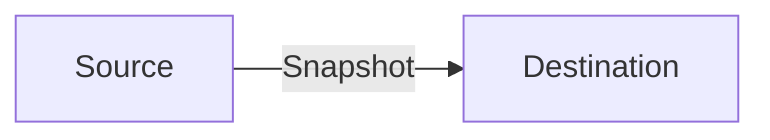
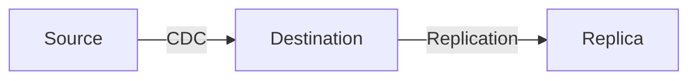
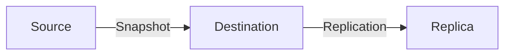
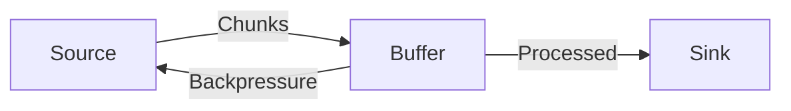
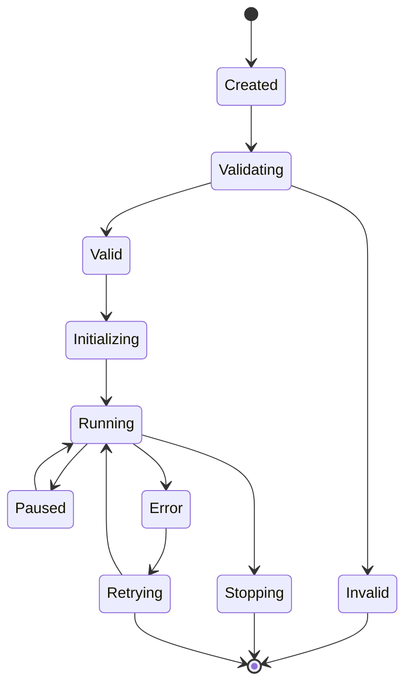
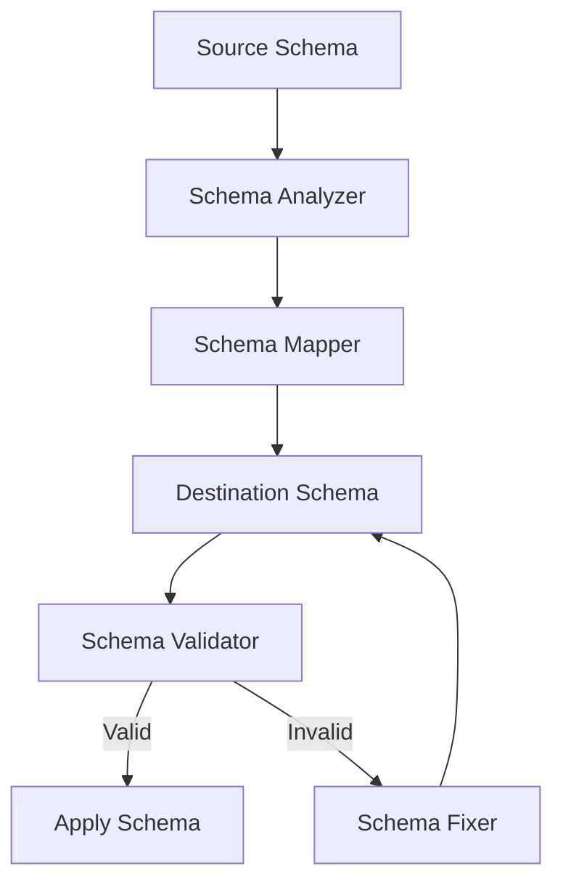
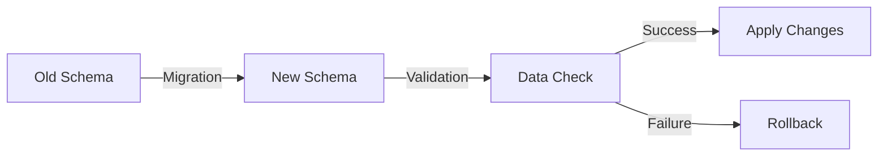
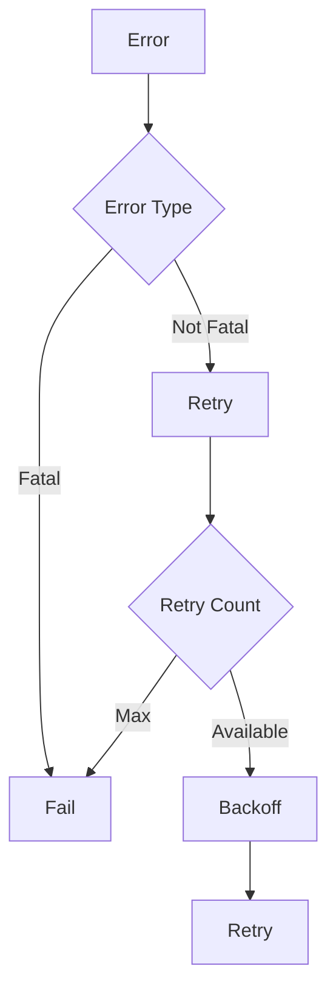

# Core Concepts

This document explains the core concepts of Transferia.

## Transfer Types

### Snapshot Transfer

A one-time transfer of data from source to destination:



Key characteristics:
- One-time operation
- Full data copy
- No change tracking
- Uses `MergeTree` tables

### Replication Transfer

Continuous transfer of changes from source to destination:



Key characteristics:
- Continuous operation
- Change tracking
- Real-time updates
- Uses `ReplacingMergeTree` tables

### Combined Transfer

Combination of snapshot and replication:



Key characteristics:
- Initial snapshot
- Followed by replication
- Consistent state
- Efficient updates

## Data Processing

### Change Items

The basic unit of data transfer:

```go
type ChangeItem struct {
    Operation OperationType
    Data      map[string]interface{}
    Schema    Schema
    Timestamp time.Time
}
```

Key features:
- Operation type (insert/update/delete)
- Data payload
- Schema information
- Timestamp

### Data Buffering



Key features:
- Memory management
- Backpressure handling
- Batch processing
- Error recovery

### State Management



Key features:
- State transitions
- Error handling
- Recovery mechanisms
- Progress tracking

## Schema Management

### Schema Inference



Key features:
- Automatic schema detection
- Schema mapping
- Schema validation
- Schema fixes

### Schema Evolution



Key features:
- Schema versioning
- Migration support
- Data validation
- Rollback capability

## Error Handling

### Error Types

1. **Transient Errors**:
   - Network issues
   - Temporary unavailability
   - Rate limiting

2. **Permanent Errors**:
   - Schema mismatches
   - Data corruption
   - Configuration errors

### Recovery Mechanisms



Key features:
- Error classification
- Retry strategies
- Backoff mechanisms
- Failure handling

## Next Steps

- Follow the [Development Workflow](./development.md)
- Explore [Advanced Topics](./advanced.md)
- Check out [Examples](../examples) 
