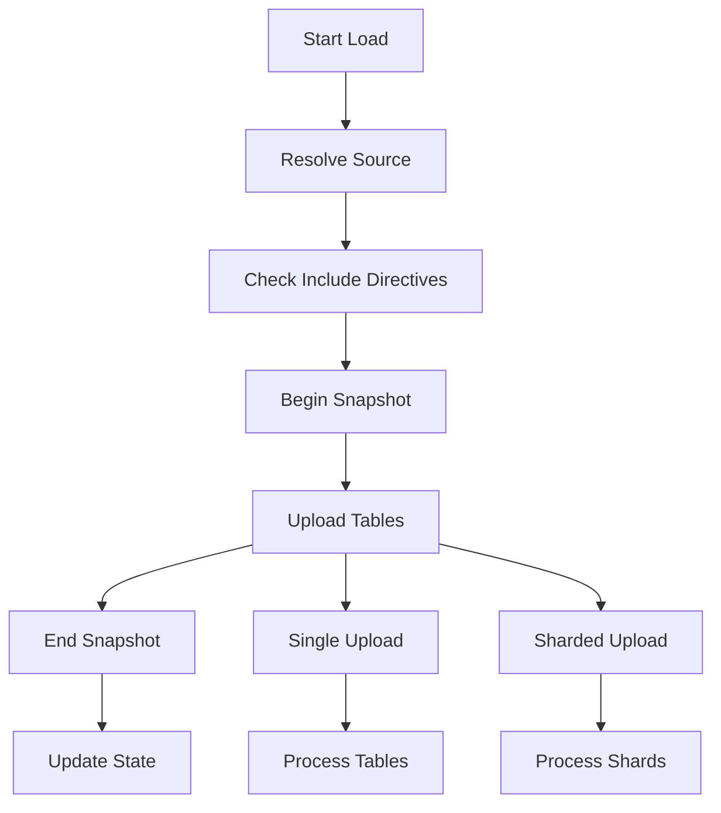

# Data Loading Process

This document explains how data loading works in Transferia, focusing on the worker component and its tasks.

## Overview

The data loading process in Transferia is handled by the worker component, which is responsible for:
- Loading snapshots from source systems
- Managing incremental state
- Coordinating data transfer
- Handling transformations
- Managing parallel uploads

## Core Components

### SnapshotLoader

The `SnapshotLoader` is the main component responsible for data loading. It handles:

1. **Source Resolution**: Connects to the source system and retrieves table information
2. **State Management**: Manages incremental and snapshot states
3. **Parallelism**: Coordinates parallel uploads across multiple workers
4. **Progress Tracking**: Monitors and reports progress
5. **Error Handling**: Manages errors and retries



## Loading Process

### 1. Initialization

```go
loader := NewSnapshotLoader(coordinator, operation, transfer, registry)
```

The loader is initialized with:
- Coordinator for distributed operations
- Operation for context about current operation
- Transfer configuration
- Metrics registry

### 2. Source Resolution

The loader first resolves the source storage and retrieves table information:

```go
tables, err := ObtainAllSrcTables(transfer, registry)
```

This includes:
- Table schemas
- Filtering rules
- Partitioning information

### 3. State Management

For incremental transfers, the loader manages state:

1. **Current State**: Retrieved from storage
2. **Next State**: Calculated based on changes
3. **State Merging**: Combines current and next states

### 4. Upload Process

The upload process can work in two modes:

#### Single Upload
Used for simple transfers where parallelization isn't needed:
- Processes tables sequentially
- Maintains table order
- Simpler error handling

#### Sharded Upload
Used for large-scale transfers:
- Distributes tables across workers
- Handles parallel processing
- Manages worker coordination
- Tracks progress per shard

## Error Handling

The loader implements sophisticated error handling:

1. **Categorized Errors**:
   - Source errors
   - Target errors
   - Internal errors
   - Network errors

2. **Retry Mechanisms**:
   - Exponential backoff
   - Per-category retry policies
   - Error aggregation

3. **Recovery**:
   - State preservation
   - Partial progress saving
   - Cleanup on failure

## Progress Tracking

Progress is tracked at multiple levels:

1. **Table Level**:
   - Rows processed
   - Bytes transferred
   - Time spent

2. **Worker Level**:
   - Tables completed
   - Current progress
   - Error states

3. **Global Level**:
   - Overall progress
   - Worker coordination
   - System metrics

## Best Practices

When working with the data loading system:

1. **Error Handling**:
   - Always use categorized errors
   - Implement proper cleanup
   - Handle partial failures

2. **State Management**:
   - Preserve state on failures
   - Handle state transitions atomically
   - Validate state consistency

3. **Performance**:
   - Use sharded uploads for large datasets
   - Monitor memory usage
   - Implement proper batching

## Oversimplified loader

Here's an example of oversimplified upload process:

```go
func (l *CustomLoader) Upload(ctx context.Context) error {
    // 1. Initialize
    source, err := l.resolveSource()
    if err != nil {
        return errors.CategorizedErrorf(categories.Source, "failed to resolve source: %w", err)
    }

    // 2. Begin snapshot
    if err := l.beginSnapshot(ctx, source); err != nil {
        return err
    }
    defer l.endSnapshot(ctx, source)

    // 3. Process data
    for {
        batch, err := source.GetNextBatch(ctx)
        if err != nil {
            return err
        }
        if batch == nil {
            break
        }

        // 4. Apply transformations
        transformed := l.transform(batch)

        // 5. Upload to destination
        if err := l.uploadBatch(ctx, transformed); err != nil {
            return err
        }

        // 6. Update progress
        l.updateProgress()
    }

    return nil
}
```

## Next Steps

- Learn about [Plugins and Registries](./plugins.md)
- Explore [Advanced Topics](./advanced.md)
- Check out [Examples](../../examples) 
