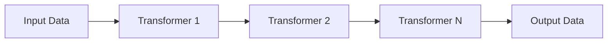

# Transformers

This document explains the transformer system in Transferia, which is responsible for data transformation during the transfer process.

## Overview

Transformers are components that modify data during the transfer process. They can:
- Modify data structure
- Filter data
- Enrich data
- Validate data
- Handle errors

## Core Concepts

### Transformer Interface

A transformer implements the following interface:

```go
type Transformer interface {
    // Check if transformer is suitable for the given table and schema
    Suitable(table abstract.TableID, schema *abstract.TableSchema) bool
    
    // Get the resulting schema after transformation
    ResultSchema(schema *abstract.TableSchema) (*abstract.TableSchema, error)
    
    // Transform the data
    Transform(items []abstract.ChangeItem) ([]abstract.ChangeItem, error)
    
    // Get transformer description
    Description() string
}
```

### Transformer Configuration

Transformers are configured using a serializable wrapper:

```go
type Transformer map[abstract.TransformerType]interface{}
```

This allows for:
- Type discrimination
- Configuration storage
- Backward compatibility

## Transformer Chain

Transformers can be chained together to create complex transformations:



Each transformer in the chain:
1. Receives data from the previous transformer
2. Applies its transformation
3. Passes the result to the next transformer

## Error Handling

The transformer system provides sophisticated error handling:

1. **Error Collection**:
   - Each transformer can report errors
   - Errors are collected and tracked
   - Failed items are marked with error information

2. **Error Output**:
   - Errors can be sent to a sink
   - Errors can be ignored (devnull)
   - Error details are preserved

3. **Error Recovery**:
   - Failed items are tracked
   - Error statistics are maintained
   - Debug information is available

## Performance Considerations

1. **Parallel Processing**:
   - Transformers can process data in parallel
   - Each table has its own transformation plan
   - Results are aggregated efficiently

2. **Schema Management**:
   - Schema changes are tracked
   - Schema compatibility is verified
   - Schema transformations are optimized

3. **Resource Usage**:
   - Memory usage is monitored
   - Processing time is tracked
   - Performance metrics are collected

## Example: Custom Transformer

Here's an example of implementing a custom transformer:

```go
type CustomTransformer struct {
    config map[string]interface{}
}

func (t *CustomTransformer) Suitable(table abstract.TableID, schema *abstract.TableSchema) bool {
    // Check if this transformer can handle the table
    return true
}

func (t *CustomTransformer) ResultSchema(schema *abstract.TableSchema) (*abstract.TableSchema, error) {
    // Define the output schema
    return schema, nil
}

func (t *CustomTransformer) Transform(items []abstract.ChangeItem) ([]abstract.ChangeItem, error) {
    result := make([]abstract.ChangeItem, 0, len(items))
    
    for _, item := range items {
        // Apply transformation
        transformed, err := t.transformItem(item)
        if err != nil {
            return nil, err
        }
        result = append(result, transformed)
    }
    
    return result, nil
}

func (t *CustomTransformer) Description() string {
    return "Custom Transformer"
}
```

## Best Practices

When implementing transformers:

1. **Schema Handling**:
   - Always validate input schemas
   - Provide accurate output schemas
   - Handle schema changes gracefully

2. **Error Management**:
   - Use descriptive error messages
   - Preserve error context
   - Implement proper cleanup

3. **Performance**:
   - Minimize memory allocations
   - Use efficient data structures
   - Implement proper batching

4. **Testing**:
   - Test with various schemas
   - Test error conditions
   - Test performance

## Monitoring and Metrics

The transformer system provides various metrics:

1. **Performance Metrics**:
   - Processing time
   - Items processed
   - Error rates

2. **Resource Metrics**:
   - Memory usage
   - CPU usage
   - Queue sizes

3. **Business Metrics**:
   - Success rates
   - Error types
   - Processing volumes

## Next Steps

- Learn about [Data Loading Process](./data-loading.md)
- Explore [Plugins and Registries](./plugins.md)
- Check out [Examples](../../examples) 